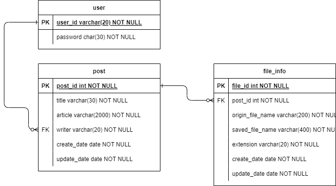

# simpleBoard
A very simple board project which go back to the basic

## 개발 환경
> 협의 후 결정 필요
> 아래는 후보
- BackEnd
    - NODEJS(Express, NestJS), Spring Boot
- FrontEnd
    - library : Vanilla JS, ReactJS, VueJS
    - template engine : 사용 안함, JSP, Thymeleaf
- DBMS
- 개발툴 맞출 필요 있는지 협의 필요

## 설계
> 게시판, 게시글 조회/수정/삭제, 파일 업로드, 회원가입, 로그인 기능만 구현
- 예시 Page
  - [게시판](./docs/blueprint/board.html)
  - [회원가입](./docs/blueprint/join.html)
  - [로그인](./docs/blueprint/sign_in.html)
  - [게시글](./docs/blueprint/read_post.html)
  - [게시글 작성](./docs/blueprint/write_post.html)
  - [게시글 수정](./docs/blueprint/update_post.html)

- ERD
    - user(사용자), post(게시글), file_info(파일정보) 3개의 table 설계
  